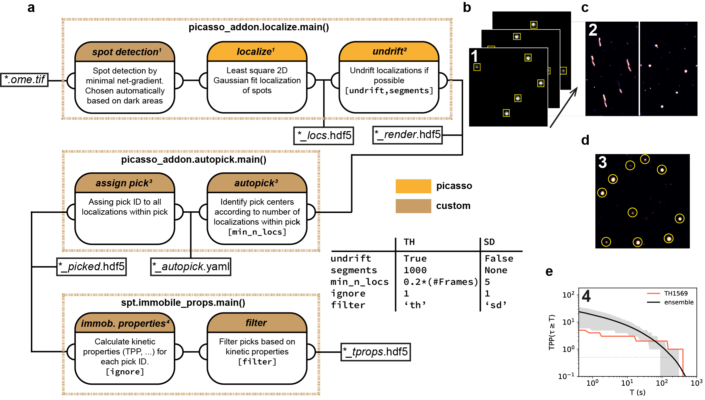

picasso_addon: Picasso extensions
=================================

This package provides some further functionalities based on `picasso <https://github.com/jungmannlab/picasso>`_ python package including:

- :ref:`Automated minimal net-gradient detection <automng>` for picasso.localize
- :ref:`Automated cluster detection <autopick>` (picks) based on picasso.render

It was used for data analysis in:
	* `Tracking Single Particles for Hours via Continuous DNA-mediated Fluorophore Exchange <https://www.biorxiv.org/content/10.1101/2020.05.17.100354v1>`_

.. toctree::
   :maxdepth: 2
   :caption: Contents
   
   installation
   howto
   modules
   contact

   

